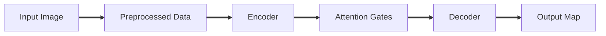

# Table of Contents

***

- [Problem Statement & Motivation]()
- U-Net Model
- Attention Integration in U-Net
- Our Method
- Result
- Conclusion
- Future Development

# Problem Statement & Motivation

***

Something we’ve all seen before in the healthcare industry — **chest X-rays**. They’re fast, inexpensive, and available almost everywhere. That’s why, in many developing countries where advanced scanners like CT or MRI are rare, chest X-rays are often the only imaging tool doctors can rely on.

Today, medical imaging stands at the core of modern healthcare. According to the _World Health Organization_, over 2 billion chest X-rays are taken every year. That makes them one of the most common diagnostic tests in the world — and one of the most powerful. From pneumonia and tuberculosis to lung cancer, these scans can literally make the difference between early treatment and a missed diagnosis.

 

But here’s the challenge: reading X-rays images accurately _isn’t an easy task_. Even when X-rays are available, the early signs of disease can be so faint, so easy to miss, that they quietly escape notice. As a result, when early signs go unseen, the consequences can be devastating.

Every year, nearly _four million people_ around the world lose their lives to lung diseases; many of which could have been prevented with early detection. Yet, in countless hospitals, radiologists face overwhelming workloads, while in some remote regions, there may be only one specialist for thousands of patients. The result is a silent crisis: delays in diagnosis, missed opportunities for treatment, and lives that could have been saved.

 

The motivation behind this project comes from a simple question — _how can we make lung diagnosis faster, fairer, and more consistent?_

**AI provides an exciting answer.&#x20;**&#x49;n the face of these challenges, artificial intelligence has emerged as a powerful ally in transforming medical diagnostics. Rather than replacing radiologists, AI amplifies their capabilities, which makes healthcare faster, more consistent, and more accessible than ever before.

It can process large volumes of chest X-rays within minutes, dramatically reducing diagnostic delays. Once trained, the system is cost-effective, making it a practical tool for smaller hospitals and rural clinics that lack specialized staff.&#x20;

And most importantly, AI offers consistent accuracy: it highlights lung regions and subtle abnormalities that may go unnoticed by the human eye. Together, these strengths make AI not just a piece of technology, but a bridge connecting medical expertise to where it’s needed most.

# U-Net Model&#x20;

***

> _A deep learning architecture specifically designed for biomedical image segmentation. Introduced in 2015 by Olaf Ronneberger et al., it has become a foundational model in the field due to its effectiveness in delineating complex structures in medical images._

## Architecture Overview

- **Contracting path (Encoder)**: Extracts hierarchical features through convolution and downsampling.
- **Expanding path (Decoder)**: Restores image resolution for pixel-wise segmentation.
- **Skip connections**: Fuse low-level spatial information with high-level semantic features.

### Why U-Net?

U-Net is designed to work well with relatively few training images. This is particularly important in the biomedical field, where labeled data can be scarce. The model uses data augmentation techniques to enhance training and improve generalization.

It's widely used for segmenting various biomedical images:

| Image Type            | Application                                                                      |
| --------------------- | -------------------------------------------------------------------------------- |
| MRI & CT Scans        | Identifying tumors, lesions, and organ boundaries                                |
| Histopathology images | Detecting cellular structures and classifying tissue types                       |
| Cell Segmentation     | Tasks like identifying individual cells and their components (Microscopy images) |

The architecture has been shown to achieve high accuracy and robustness in various segmentation tasks, often outperforming traditional methods. Its ability to produce precise pixel-wise predictions makes it a preferred choice for medical image analysis.

# Attention Integration in U-Net

***

_Attention U-Net_ is an extension of the U-Net architecture for image segmentation, distinguished by the incorporation of **attention gates** (AGs) into its skip connections.

 

An AG modulates the encoder features before fusion with the decoder features, supplying a context-driven mechanism that automatically emphasizes task-relevant spatial regions and suppresses background or distractor information. This design directly addreses issues such as:

1. High variability in organ morphology (e.g., pancreas, retinal vessels).&#x20;
2. Low contrast between anatomical structures and background.
3. The computational and design burden of multi-stage or cascaded segmentation pipelines.

### Why is attention needed in the U-Net?

- Focuses on the most relevant regions. Attention Gates guide the model toward important lung structures while reducing the influence of background noise.
- Improves segmentation performance. By emphasizing meaningful features, the model converges faster and generalizes better to unseen images.
- Suppresses irrelevant information automatically. The network learns to ignore non-essential regions without requiring additional localization modules.
- Adapts to different anatomical structures. Attention Gates effectively capture target regions of varying shapes and sizes in medical images.
- Enhances U-Net with minimal overhead. The attention mechanism can be integrated easily, improving sensitivity and accuracy with only a small increase in model parameters.

 

# Our Method

***

## Setup

- **Language**: Python
- **Environment**: Google Colab (GPU-enabled)
- **Frameworks**: TensorFlow / Keras
- **Loss & Metrics**: Binary Crossentropy, Dice Coefficient, Jaccard Index

## Pipeline

## Tested Dataset

<Cards>
> [!WARNING]

**Dataset Notice:This project uses a publicly available chest X-ray dataset obtained from Kaggle for research and educational purposes only. All copyrights, ownership, and intellectual property rights remain with the original dataset creators and contributors. This repository does not aim ownership of the dataset and only includes code, documentation, and project materials developed by the author. Please refer to the original dataset source before downloading or reusing the data: 

Chest X-ray Dataset for Tuberculosis Segmentation**

</Cards>

 
